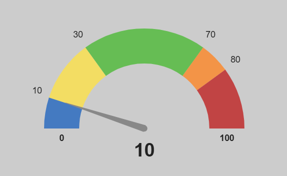

# Gauge charts library
Gauge charts library for react. Easily used and fully customizable. Powered by Chart.js.

## Usage example (Every prop used with their default values. Props are optional):


```html
<GaugeChart
    needleCurrentValue={0}
    dataUnit={""}
    minValue={0}
    maxValue={100}
    veryLowLimit={10}
    lowLimit={30}
    highLimit={70}
    veryHighLimit={90}
    veryLowColor="rgba(27, 98, 190, 0.77)"
    lowColor="rgba(255, 227, 68, 0.77)"
    goodColor="rgba(71, 185, 48, 0.77)"
    highColor="rgba(255, 132, 31, 0.77)"
    veryHighColor="rgba(190, 27, 27, 0.77)"
    borderVeryLowColor="rgba(27, 98, 190, 0.77)"
    borderLowColor="rgba(255, 227, 68, 0.77)"
    borderGoodColor="rgba(71, 185, 48, 0.77)"
    borderHighColor="rgba(255, 132, 31, 0.77)"
    borderVeryHighColor="rgba(190, 27, 27, 0.77)"
    needleBorderColor="rgb(136, 136, 136)"
    needleFillColor="rgb(136, 136, 136)"
    needleWidth={5}
    meterFont="bold 30px sans-serif"
    meterColor="rgb(34, 34, 34)"
    labelFont="14px sans-serif"
    labelColor="rgb(34, 34, 34)"
    aspectRatio={1.5}
    paddingTop={20}
    paddingBottom={80}
    paddingLeft={40}
    paddingRight={40}
    arcBorderWidth={0}
    arcBorderColor="transparent"
    datasetBorderWidth={0}
    cutout="65%"
    canvasWidth={400}
    animationsEnabled={false}
/>
```
## Props:
- **needleCurrentValue:** The needle value. This should be filled with an useState(the chart won't render again, just the needle).
- **dataUnit:** The data unit, string. I.E: "ºC", "Hz", "Kg".
  
- **minValue:** The minimum value for the chart.
- **maxValue:** The maximum value for the chart.
  
- **veryLowLimit:** This is where the 2 first chart fragments will collide.
- **lowLimit:** This is where the 2nd & 3rd chart fragments will collide.
- **highLimit:** This is where the 3rd & 4th chartfragments will collide.
- **veryHighLimit:** This is where the 2 last chart fragments will collide.
  
- **veryLowColor:** 1st fragment color.
- **lowColor:** 2nd fragment color.
- **goodColor:** 3rd fragment color.
- **highColor:** 4th fragment color.
- **veryHighColor:** Last fragment color.
- **borderVeryLowColor:** 1st fragment border color.
- **borderLowColor:** 2nd fragment border color.
- **borderGoodColor:** 3rd fragment border color.
- **borderHighColor:** 4th fragment border color.
- **borderVeryHighColor:** Last fragment border color.

- **needleBorderColor:** The needle's border color.
- **needleFillColor:** The needle's color.
- **needleWidth:** The needle's width.
  
- **meterFont:** The font for the Flow Meter.
- **meterColor:** The color for the Flow Meter font.

- **labelFont:** The font for the labels.
- **labelColor:** The color for the labels.

- **aspectRatio:** The chart aspectRatio.
- **paddingTop:** Chart top padding.
- **paddingBottom:** Chart bottom padding.
- **paddingLeft:** Chart left padding.
- **paddingRight:** Chart right padding.

- **arcBorderWidth:** Border width for the arc of the gauge.
- **arcBorderColor:** Border color for the arc of the gauge.
- **datasetBorderWidth:** Border width for every dataset (chart section I.E: high, very high, etc).
- **cutout:** The arc width (Try changing it to see, I can't explain it better).
- **canvasWidth:** The whole canvas width in pixels(optional, is in responsive by default).
- **animationsEnabled:** Enables Chart.js animations on mount and updates. Default is `false` (no animation). Set to `true` to restore animations.